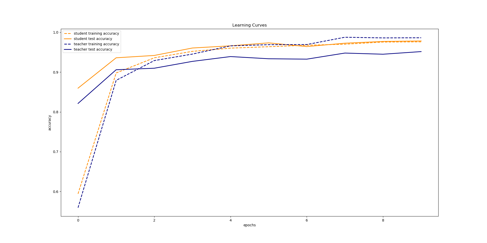

# Tensorflow-Knowledge-Distillation

This is an implementation of the knowledge distillation technique as described by Geoffrey Hinton, Oriol Vinyals, and Jeff Dean in the following paper: https://arxiv.org/abs/1503.02531


The following dependencies are required to run the example code included in the ```distiller.py``` file:
```
tensorflow

numpy

matplotlib

tqdm
```

The core idea of knowledge distillation is that by training a network on the hard targets provided by the dataset and soft targets provided by another network, the network will be able to generalize better to new data and may even require less data overall during the training process. The network that generates the soft targets is called the teacher network. The network that trains on those targets is the student network.

For the example code in the ```distiller.py``` file, the teacher network is a model with the following architecture:

```
Model: "sequential_1"
_________________________________________________________________
Layer (type)                 Output Shape              Param #   
=================================================================
conv2d (Conv2D)              (None, 26, 26, 32)        320       
_________________________________________________________________
max_pooling2d (MaxPooling2D) (None, 13, 13, 32)        0         
_________________________________________________________________
conv2d_1 (Conv2D)            (None, 11, 11, 32)        9248      
_________________________________________________________________
max_pooling2d_1 (MaxPooling2 (None, 5, 5, 32)          0         
_________________________________________________________________
flatten (Flatten)            (None, 800)               0         
_________________________________________________________________
dense (Dense)                (None, 56)                44856     
_________________________________________________________________
dense_1 (Dense)              (None, 56)                3192      
_________________________________________________________________
dense_2 (Dense)              (None, 56)                3192      
_________________________________________________________________
dense_3 (Dense)              (None, 56)                3192      
_________________________________________________________________
teacher_logits (Dense)       (None, 10)                570       
=================================================================
Total params: 64,570
Trainable params: 64,570
Non-trainable params: 0
_________________________________________________________________
None
```

The student network is a network of an identical architecture. First, the teacher network is trained on a dataset, in this case MNIST was used, then it generates a set of soft targets for a transfer set. The student network then uses the soft targets generated from the teacher network and the hard targets from the dataset itself during training.

The results are shown below:



Here we see that the student model, which is trained on soft targets, is much less prone to overfitting, compared to the teacher model


